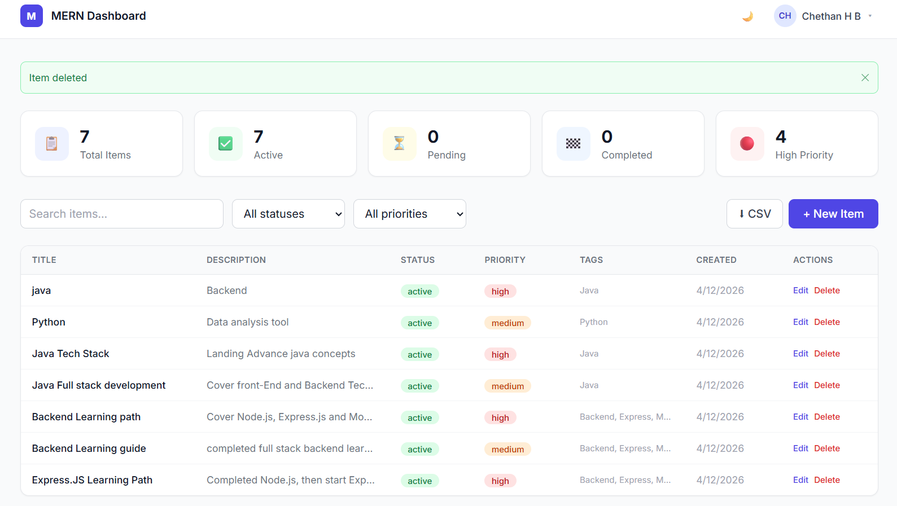
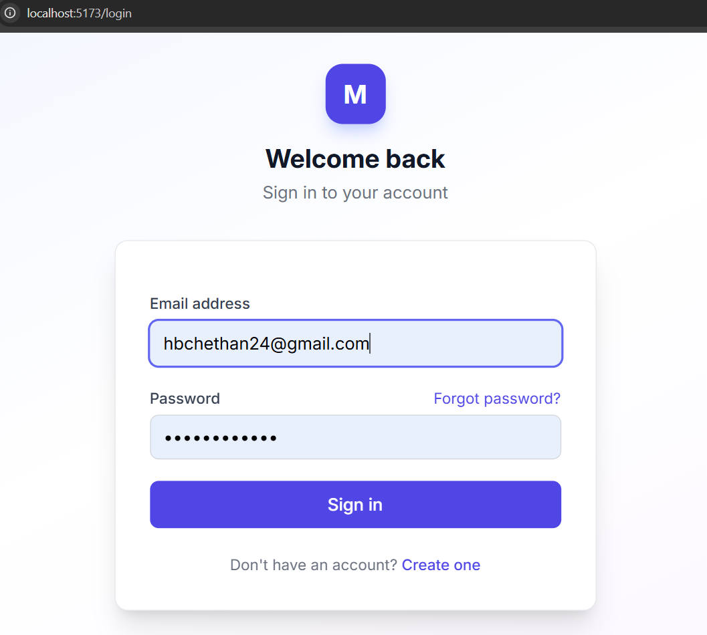
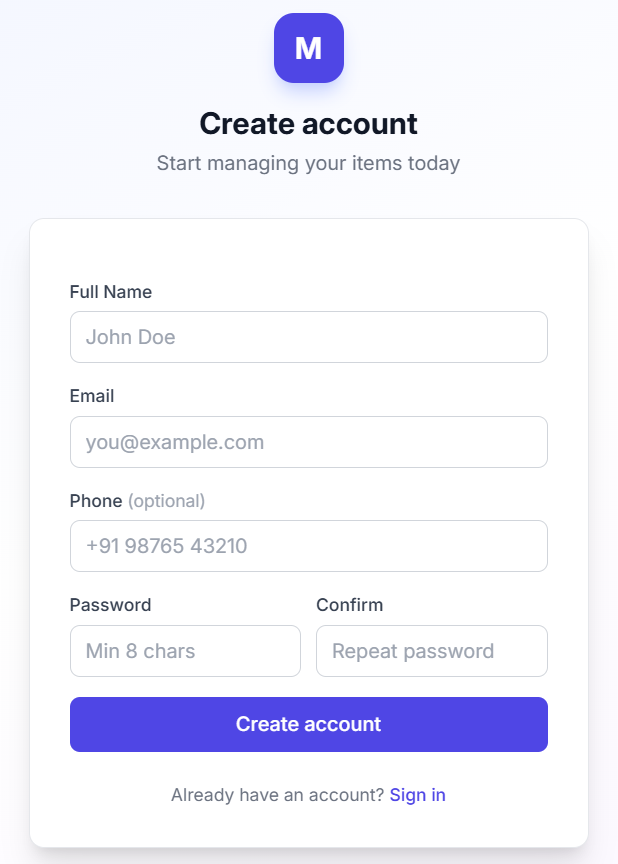
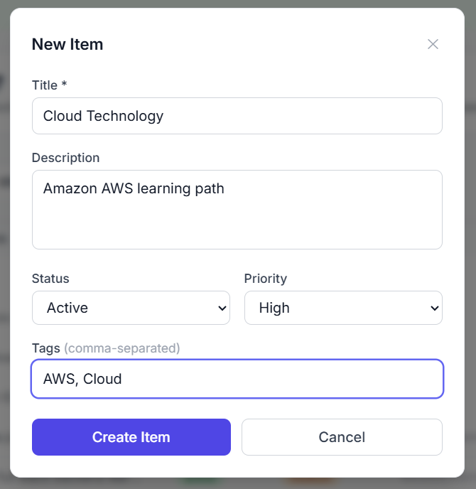
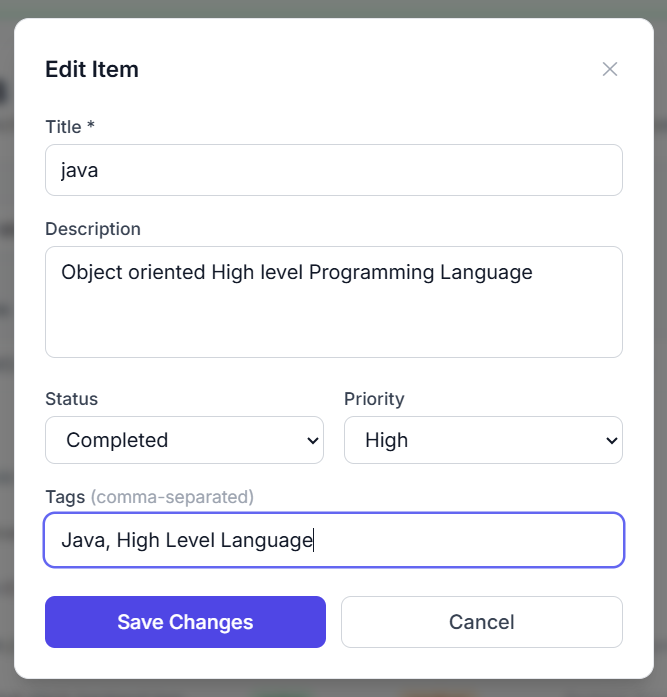
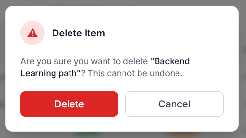
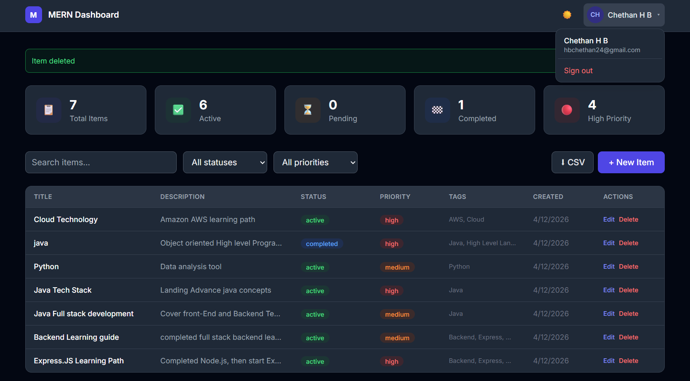
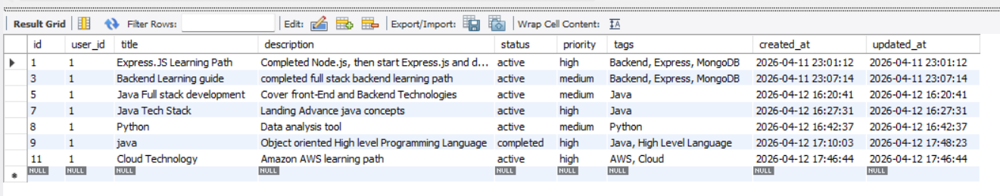

# MERN Stack Authentication & Dashboard CRUD

### MySQL | Express.js | React.js | Node.js

> A production-ready full-stack web application featuring JWT authentication,
> email-based password reset, and a fully functional dashboard with CRUD operations
> — built with React, Node.js, Express, and MySQL.



---

## Features

- **User Authentication** — Register, Login with JWT tokens
- **Password Reset** — Forgot password via email (Nodemailer)
- **Email Verification** — Token-based email verification on registration
- **Dashboard CRUD** — Create, Read, Update, Delete items
- **Advanced Filtering** — Search by title/description, filter by status & priority
- **Pagination** — Server-side pagination with page controls
- **Statistics Cards** — Live counts: Total, Active, Pending, Completed, High Priority
- **CSV Export** — Download all items as a spreadsheet
- **Dark Mode** — Toggle between light and dark theme
- **Responsive Design** — Works on mobile, tablet, and desktop
- **Security** — bcrypt password hashing, parameterized SQL queries, CORS, JWT middleware

---

## Tech Stack

| Layer     | Technology                                           |
| --------- | ---------------------------------------------------- |
| Frontend  | React 18, Vite, Tailwind CSS, React Router v6, Axios |
| Backend   | Node.js, Express.js                                  |
| Database  | MySQL 8.0, mysql2 (connection pooling)               |
| Auth      | JWT (jsonwebtoken), bcryptjs                         |
| Email     | Nodemailer                                           |
| Dev Tools | Nodemon, Postman                                     |

---

## Project Structure

```
mern-mysql-auth-crud/
├── backend/
│   ├── config/
│   │   └── db.js                 # MySQL connection pool
│   ├── controllers/
│   │   ├── authController.js     # Register, Login, Reset Password
│   │   └── itemController.js     # CRUD + Stats + CSV Export
│   ├── middleware/
│   │   ├── auth.js               # JWT verification middleware
│   │   └── errorHandler.js       # Global error handler
│   ├── routes/
│   │   ├── authRoutes.js         # /api/auth/*
│   │   └── itemRoutes.js         # /api/items/*
│   ├── utils/
│   │   └── sendEmail.js          # Nodemailer email utility
│   ├── .env.example              # Environment variables template
│   ├── server.js                 # Express app entry point
│   └── package.json
├── frontend/
│   ├── src/
│   │   ├── api/
│   │   │   ├── axios.js          # Axios instance + interceptors
│   │   │   ├── authApi.js        # Auth API calls
│   │   │   └── itemApi.js        # Item API calls
│   │   ├── context/
│   │   │   └── AuthContext.jsx   # Global auth state (React Context)
│   │   ├── components/
│   │   │   ├── Navbar.jsx        # Top navigation bar
│   │   │   ├── StatsCard.jsx     # Statistics display card
│   │   │   ├── ItemModal.jsx     # Create/Edit item modal
│   │   │   ├── DeleteConfirm.jsx # Delete confirmation dialog
│   │   │   └── Alert.jsx         # Success/Error alert messages
│   │   ├── pages/
│   │   │   ├── Login.jsx
│   │   │   ├── Register.jsx
│   │   │   ├── ForgotPassword.jsx
│   │   │   ├── ResetPassword.jsx
│   │   │   └── Dashboard.jsx
│   │   ├── routes/
│   │   │   ├── ProtectedRoute.jsx
│   │   │   └── PublicRoute.jsx
│   │   ├── App.jsx
├   ├   ├── index.css
│   │   └── main.jsx
│   └── package.json
├── database.sql                  # Complete MySQL schema
├── screenshots/                  # App screenshots
└── README.md

```

---

## Prerequisites

Make sure you have installed:

- [Node.js](https://nodejs.org/) v20+
- [MySQL](https://dev.mysql.com/downloads/) v8.0+
- [Git](https://git-scm.com/)

---

## Setup & Installation

### 1. Clone the Repository

```bash
git clone https://github.com/Chethan-H-B/mern-mysql-auth-crud.git
cd mern-mysql-auth-crud
```

### 2. MySQL Database Setup

Open MySQL Workbench or run in terminal:

```bash
mysql -u root -p < database.sql
```

Or manually run in MySQL:

```sql
CREATE DATABASE mern_auth_db;
USE mern_auth_db;
-- Then run the contents of database.sql
```

Verify setup:

```sql
USE mern_auth_db;
SHOW TABLES;
DESCRIBE users;
DESCRIBE items;
```

### 3. Backend Setup

```bash
cd backend
npm install
```

Create your `.env` file:

```bash
cp .env.example .env
```

Edit `.env` with your values:

```env
PORT=5000
NODE_ENV=development

DB_HOST=localhost
DB_PORT=3306
DB_USER=root
DB_PASSWORD=your_mysql_password
DB_NAME=mern_auth_db

JWT_SECRET=your_super_secret_key_min_32_characters
JWT_EXPIRE=7d

EMAIL_HOST=smtp.gmail.com
EMAIL_PORT=587
EMAIL_USER=your_email@gmail.com
EMAIL_PASS=your_gmail_app_password
EMAIL_FROM="MERN App <noreply@mernapp.com>"

FRONTEND_URL=http://localhost:5173
```

Start backend:

```bash
npm run dev
```

You should see:

### 4. Frontend Setup

Open a new terminal:

```bash
cd frontend
npm install
npm run dev
```

App opens at: **http://localhost:5173**

---

## API Documentation

### Auth Endpoints

| Method | Endpoint                    | Access    | Description        |
| ------ | --------------------------- | --------- | ------------------ |
| POST   | `/api/auth/register`        | Public    | Register new user  |
| POST   | `/api/auth/login`           | Public    | Login, returns JWT |
| GET    | `/api/auth/me`              | Protected | Get current user   |
| POST   | `/api/auth/forgot-password` | Public    | Send reset email   |
| POST   | `/api/auth/reset-password`  | Public    | Reset with token   |
| PUT    | `/api/auth/profile`         | Protected | Update profile     |

### Item Endpoints (All Protected)

| Method | Endpoint            | Description                        |
| ------ | ------------------- | ---------------------------------- |
| GET    | `/api/items`        | Get items (filter/search/paginate) |
| POST   | `/api/items`        | Create new item                    |
| GET    | `/api/items/:id`    | Get single item                    |
| PUT    | `/api/items/:id`    | Update item                        |
| DELETE | `/api/items/:id`    | Delete item                        |
| GET    | `/api/items/stats`  | Dashboard statistics               |
| GET    | `/api/items/export` | Export items as CSV                |

### Query Parameters for GET /api/items

| Parameter  | Type   | Description                        |
| ---------- | ------ | ---------------------------------- |
| `status`   | string | Filter: active, pending, completed |
| `priority` | string | Filter: low, medium, high          |
| `search`   | string | Search in title and description    |
| `page`     | number | Page number (default: 1)           |
| `limit`    | number | Items per page (default: 10)       |

---

## Screenshots

### Login Page



### Register Page



### Dashboard


### Add New Item



### Edit Item



### Delete Confirmation



### Dark Mode



### MySQL Database



---

## Security Features

- Passwords hashed with **bcryptjs** (12 salt rounds)
- **JWT tokens** with expiry for session management
- **Parameterized SQL queries** prevent SQL injection
- **CORS** configured for frontend origin only
- `.env` file excluded from git via `.gitignore`
- Anti-enumeration on forgot password endpoint
- JWT middleware re-validates user existence on every protected request

---

## Gmail App Password Setup (for Email)

1. Go to Google Account → Security
2. Enable 2-Step Verification
3. Go to App Passwords → Generate
4. Use that 16-character password as `EMAIL_PASS` in `.env`

---

## Mentor & Institution

- **Mentor:** Jacob Dennis
- **Institution:** CampusPe
- **Assignment:** MERN Stack Authentication & CRUD with MySQL

---

## Author

**Chethan H B**

- GitHub: [@YOUR_USERNAME] (https://github.com/Chethan-H-B)
